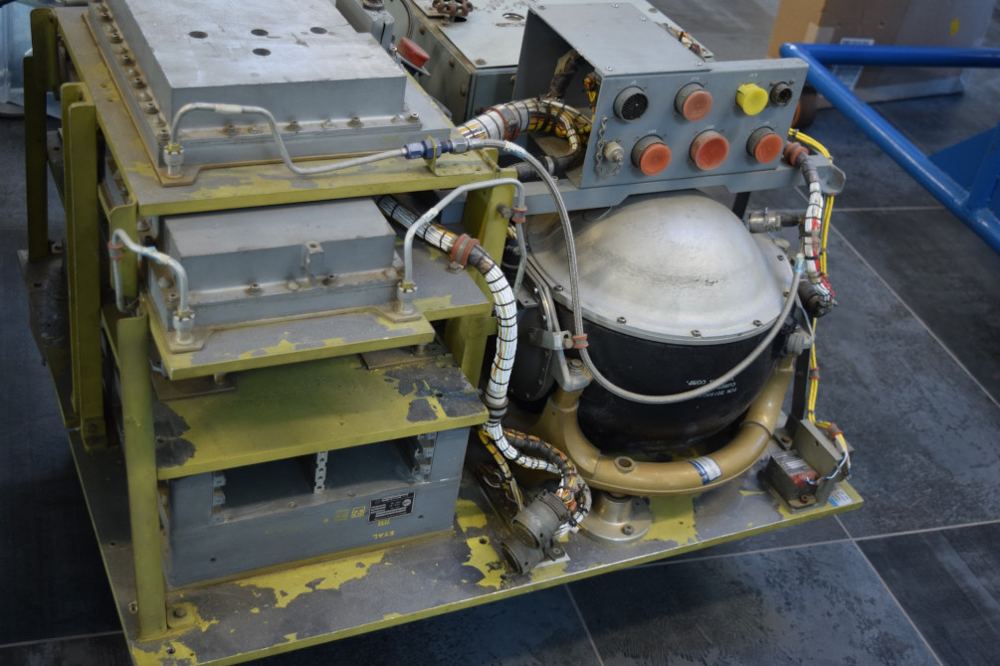
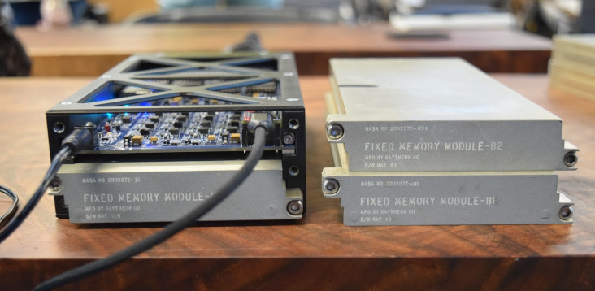

# About the Aurora 88 Executable Program

Aurora 88 was the standard system-checkout software for the LM guidance system.

The file Aurora88.bin contains data dumped by Mike Stewart from physical fixed-memory modules offered to us by Steve Jurvetson. Though these modules were from an F-8 Digital Fly By Wire guidance system, they contained AURORA software rather than the DIGFLY software native to the F-8 Digital Fly By Wire project, so presumably they were being used for system checkout. Here are some nice photos of the guidance system and of the modules being dumped:

Source code for Aurora 88 will hopefully become available eventually, via reconstruction from related programs and disassembly, but presently we only have the executable form of the program, in the form of this core dump.  There are a surprisingly-large number of differences between these Aurora 88 modules and DAP Aurora 12, which is somewhat-later software forked from Aurora, and the only other Aurora version we have, as of this writing.

The entire program is made up of dumps from 3 separate memory modules, concatenated to form a complete rope.  The dumps of the individual modules are all available in the Rope-Module Dump Library folder of the Virtual AGC source tree, and specifically are the files

* 2003972-011-BLK2-Aurora88-B1.bin
* 2003972-091-BLK2-Aurora88-B2.bin
* 2003972-111-BLK2-Aurora88-B3.bin

As we expected in advance, the B1 and B3 modules are identical to some modules already in the library, namely

* 2003053-061-BLK2-Aurora85+-B1.bin
* 2003053-181-BLK2-Aurora88-B3.bin

The Aurora 88 rope image file in this folder, namely Aurora88.bin, is a processed form of the individual-module files in the Rope-Module Dump Library.  First, the individual module dumps have to be concatenated to form a single large file, and second, they have to be converted from "hardware" format to "Virtual AGC" format.  In Linux or Mac OS X, that looks like this:

    cat ... the 3 module-dump files delimited by spaces ... > Aurora88-hardware.bin
    pieceworkAGC.py --bin --add=Aurora88-hardware.bin,1,1,0 >Aurora88.bin
    mv Aurora88-hardware_vagc.bin Aurora88.bin

In Windows, I *presume* &mdash; but don't vouch for it! &mdash; that the equivalent steps would

    copy /B ... the 3 files, separated by '+' signs ... Aurora88-hardware.bin
    pieceworkAGC.py --bin --add=Aurora88-hardware.bin,1,1,0 >Aurora88.bin
    ren Aurora88-hardware_vagc.bin Aurora88.bin

The **pieceworkAGC.py** program referenced here can be found in the Tools/disassemblerAGC/ folder of the source tree.  The final file mentioned above, Aurora.bin, is the rope image required by **yaAGC**.  The purpose of the **pieceworkAGC.py** program here is to convert the dumps from a format we call the "hardware" format to the format instead produced by our modern AGC assemblers and accepted by our modern AGC CPU emulators.  The Python 3 programming language is required.  (Actually, the **pieceworkAGC.py** program could have done the entire conversion, eliminating the need for `cat` or `copy` entirely, but the steps listed above are what I did before that fact occurred to me.)

Of course, you don't actually need to *do* this yourself, since the file Aurora88.bin is already present in this folder; but that's how it's done if you need to do it.

